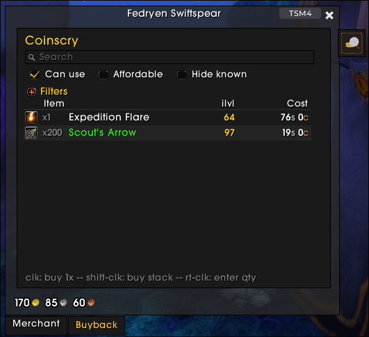
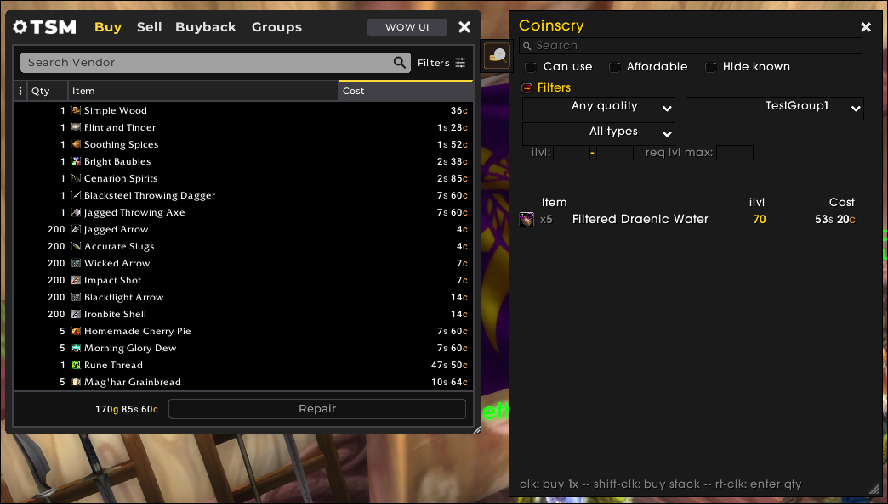
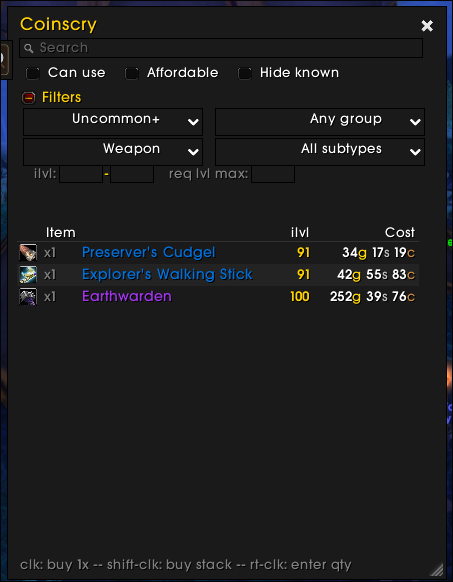
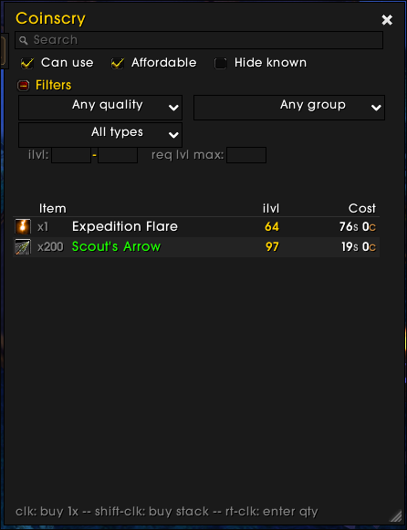

# Coinscry

Vendor-browsing filters for World of Warcraft TBC Anniversary. Best paired with [TradeSkillMaster](https://www.tradeskillmaster.com/), works standalone too.

[Download on CurseForge](https://www.curseforge.com/wow/addons/coinscry) · [Releases on GitHub](https://github.com/WastelandRoot/coinscry/releases)

TSM ships its vendor filter button as a stub (literal `-- TODO` in `Core/UI/VendoringUI/Buy.lua`), so vendor browsing inside TSM is text-search only. Coinscry adds quality, item-type, item-level, affordability, can-use, already-known, demon-type, and TSM-group filters via a side tab + slide-out panel that follows whichever vendor frame (TSM's or Blizzard's) is in front.

## Screenshots

| Embedded inside Blizzard's merchant frame (vanilla mode) | Attached to TSM's vendor frame, filtered to a TSM group |
|---|---|
|  |  |

| Quality + weapon-type narrowing (filters section expanded) | Can-use + affordable checkboxes filtering the row set |
|---|---|
|  |  |

## Installation

1. Download the latest release (or clone this repo into your AddOns folder).
2. Copy the `coinscry` folder into `<WoW>/_anniversary_/Interface/AddOns/`. The final path should look like `…/AddOns/coinscry/coinscry.toc`.
3. Launch the game. You should see Coinscry in your AddOns list (with the logo as its icon).

Requires WoW **TBC Anniversary** client (Interface `20505`). TradeSkillMaster is an **optional dependency** — without it, all non-group filters still work and the addon attaches to Blizzard's merchant frame only. ElvUI is detected at load; if present, panel and widgets pick up ElvUI's skinning automatically.

## Features

- **Search** — case-insensitive substring on item names.
- **Quality** — Common+ through Legendary.
- **Item type / subtype** — Armor (Cloth/Leather/Mail/Plate), Weapon (1H Sword / Polearm / Bow / …), Consumable, Trade Goods, Recipe, etc. Auto-populated from items present at the current vendor.
- **Item level** — min / max range.
- **Required level** — max.
- **TSM group** — exact match against a TSM group path (requires TSM).
- **Affordable** — checks both gold and any extended-cost items/currencies.
- **Can use** — hides items WoW marks as red in the merchant frame (wrong class, wrong armor / weapon proficiency, level too low, missing profession, etc.). Driven by `GetMerchantItemInfo`'s `isUsable` flag, so it matches WoW's own determination exactly.
- **Hide already known** — recipes the player has learned, and warlock demon tomes the currently-summoned pet has learned.
- **Demon type** — Imp / Voidwalker / Succubus / Felhunter / Felguard. Contextual: only appears at vendors selling warlock demon tomes.

## Buying from the filtered list

- **Left-click** a row — buys 1
- **Shift-left-click** — buys a full stack (e.g., 200 arrows)
- **Right-click** — quantity dialog (defaults to the stack size, capped at the merchant's remaining supply for limited items)

## Slash commands

- `/coinscry` (or `/coinscry toggle`) — toggle the filter panel at a vendor
- `/coinscry config` — open the settings window (also reachable from *Game Menu → Options → AddOns → Coinscry*)
- `/coinscry reset` — clear all active filters
- `/coinscry anchor [merchant|tsm|auto]` — manually pin the anchor or return to auto-detect
- `/coinscry trace [on|off]` — log anchor switches to chat (diagnostic)
- `/coinscry status` / `poll` / `dump` / `groups` / `scan` / `debug` / `theme` — diagnostics

## Known limitations

### Demon-type filter is English-only

The demon-type filter matches `Teaches Imp …` / `Teaches Voidwalker …` etc. in the item tooltip. On non-English clients the word "Teaches" and/or the demon name is localized, so the pattern doesn't match and the dropdown won't appear at warlock trainers. PRs welcome adding patterns for other locales in `Scanner.lua`.

The other filters use WoW's localized internals (e.g., `ITEM_SPELL_KNOWN` for already-known) and work on all locales out of the box.

### Warlock demon tomes: only the currently summoned demon is checked

The WoW API only exposes the currently summoned pet's spellbook. "Hide already known" can correctly hide tomes the summoned demon already knows, but tomes for other demons (e.g., a Voidwalker tome while you have your Imp out) always appear unknown — the API can't see Voidwalker's spellbook unless Voidwalker is the active pet.

Standard workflow: summon the relevant demon before visiting that demon's trainer.

### Multiple TSM application UIs

If you have multiple TSM application UIs open at once (Vendoring + Crafting, for example), the anchor logic picks the first matching `TSM_FRAME:LargeApplicationFrame:*` it finds — TSM doesn't expose a way to distinguish them from outside. In practice this is rare; if it bites you, pin the anchor manually with `/coinscry anchor merchant` or `/coinscry anchor tsm`.

## Development

Active development happens on [Forgejo at git.kal.run/kaltec/coinscry](https://git.kal.run/kaltec/coinscry); GitHub is the release mirror.

Issues and pull requests welcome on github. See [`DESIGN.md`](DESIGN.md) for the architecture rationale (especially §3, which covers why the addon is a companion overlay rather than something injected into TSM's vendor frame).

## License

[MIT](LICENSE).
